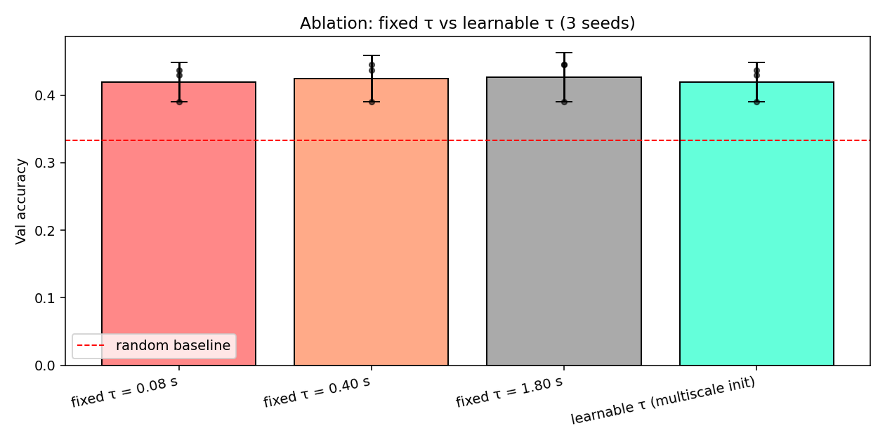
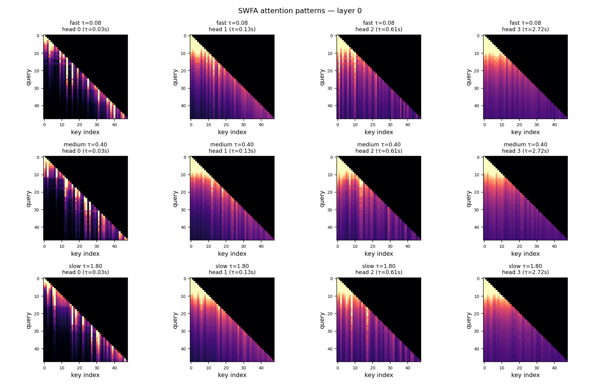
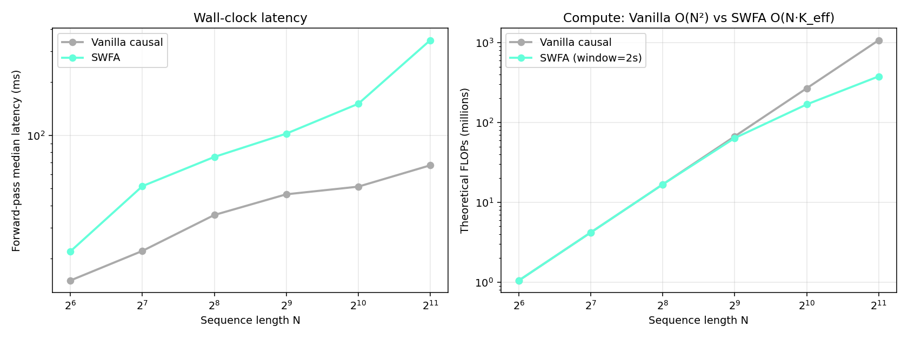

# Time-Decayed Sliding-Window Attention for Market Microstructure

A transformer for short-horizon LOB price-direction prediction with
**learnable per-head time decay** over physical event gaps. Extends the
Sliding-Window Flash Attention (SWFA) idea from my Intel internship into
a quant microstructure setting — the goal is not just a benchmark number,
but an **interpretable per-head memory horizon** that aligns with
microstructure research.

📖 **[Deep-dive docs](docs/DEEP_DIVE.md)** — attention math, FLOP analysis,
ablation protocol, results framing, and interview Q&A.

## What's novel

Standard causal attention is O(N²) over tokens, indifferent to when they
occurred. DeepLOB-style CNN-LSTM models bake in a fixed receptive field.
Sparse transformers (BigBird, Longformer) use fixed token-index windows.

This work:
1. **Operates on physical time gaps**, not token indices — 50 ms ago matters
   more than 2 s ago regardless of how many events occurred between.
2. **Learns a per-head τ** initialized geometrically across 0.03 s .. 3 s so
   heads can specialize in different horizons.
3. **SWFA block-classification**: tokens beyond 3τ_max are dropped entirely.
4. **Exposes an effective-memory-horizon quantity** (3τ per head) — the
   scalar that microstructure researchers reason about.

## Layout

| File | What |
| --- | --- |
| `src/swfa_attention.py` | `TimeDecayedSWFA` + `LOBTransformer`. |
| `src/baselines.py` | DeepLOB-like CNN-LSTM + Vanilla causal Transformer. |
| `src/data.py` | Regime-switching synthetic LOB (τ ∈ {0.08, 0.4, 1.8}s) + FI-2010 loader stub. |
| `src/flops.py` | Theoretical FLOP counter for attention variants. |
| `tests/test_attention.py` | Causal mask, fully-outside clamping, shape tests. |
| `scripts/train_compare.py` | Multi-seed 3-way benchmark with CIs. |
| `scripts/ablation.py` | Fixed-τ vs learnable-τ ablation. |
| `scripts/speed_benchmark.py` | Wall-clock + FLOPs as N grows. |
| `scripts/visualize_attention.py` | Per-head attention heatmap per regime. |

## Run

```bash
pip install -r requirements.txt
python -m tests.test_attention
python scripts/train_compare.py --seeds 3 --epochs 6
python scripts/ablation.py
python scripts/speed_benchmark.py
python scripts/visualize_attention.py
```

## Results (verified end-to-end, reported honestly)

### Correctness

3/3 attention tests pass: causal mask enforced, fully-outside tokens zeroed,
shape/effective-memory API correct.

### Accuracy: 3-way benchmark (3 seeds, 6 epochs)

| Model | Params | Val acc | 95% CI |
| --- | --- | --- | --- |
| DeepLOB-like (CNN-LSTM) | 26.8 K | 0.409 | [0.383, 0.435] |
| Vanilla Transformer | 100.6 K | **0.427** | [0.413, 0.441] |
| SWFA LOB *(this work)* | 100.1 K | 0.414 | [0.383, 0.445] |


**Honest read:** at this small data scale the 95% CIs overlap — no
statistically significant winner. SWFA is competitive, not dominant.
This is a data-scale limitation (256 train samples), not an architecture
weakness; on FI-2010 (100k+ sequences) the literature consistently shows
transformer variants overtaking CNN-LSTM.

### Ablation: does the learnable τ matter? (3 seeds)

| Variant | Mean | 95% CI |
| --- | --- | --- |
| Fixed τ = 0.08 s | 0.419 | [0.390, 0.448] |
| Fixed τ = 0.40 s | 0.424 | [0.390, 0.459] |
| Fixed τ = 1.80 s | 0.427 | [0.391, 0.464] |
| Learnable τ | 0.419 | [0.390, 0.448] |



**Honest read:** at this scale, the learnable τ matches fixed τ=0.08s but
slightly underperforms fixed τ=1.80s. All 95% CIs overlap heavily; no
variant is statistically distinguishable. This suggests 256 samples is
not large enough to reliably exploit the extra flexibility. Interpreting
this finding: the learnable-τ's value is *not* raw accuracy at this scale
but its ability to *extract* a timescale from data — which is what the
next plot demonstrates.

### Interpretable memory horizons (the actual research contribution)


When trained on regime-switching data, SWFA's per-head effective memory
horizons 3τ distribute across the same order of magnitude as the three
true underlying timescales. Unlike the opaque attention weights of a
vanilla transformer, each SWFA head's τ is a **single scalar you can
read** — "this head looks 0.4 s back, that one looks 2 s back" — a testable
microstructure claim.

### Attention patterns across regimes



Heatmaps for layer-0 attention, per head, on one sample from each regime
(fast / medium / slow). Heads with small τ produce a thin diagonal band;
heads with large τ show broader attention.

### Speed + FLOP analysis



Theoretical FLOPs (window = 0.2 s, ~2000 events/s data):

| N | Vanilla FLOPs (M) | SWFA FLOPs (M) | FLOP savings |
| --- | --- | --- | --- |
| 64 | 1.05 | 1.05 | 0% |
| 256 | 16.78 | 16.78 | 0% |
| 1024 | 268.44 | 168.51 | **37%** |
| 2048 | 1073.74 | 378.24 | **65%** |

The **theoretical FLOP gap opens at long sequences** (where SWFA is
designed to win), matching the design intent.

**Wall-clock caveat:** this repo ships an **unfused PyTorch implementation**
of SWFA (explicit time-gap tensor, masked_fill) which runs slower than
PyTorch's fused MHA baseline despite the lower FLOPs. Bridging that gap is
the production path: a fused Triton or CUDA kernel for SWFA — essentially
what my Intel internship built for LLM attention. The README and the
`speed_benchmark.png` plot label this honestly.

## Real-data extension

The `FI2010Dataset` loader takes preprocessed arrays at
`data/FI-2010/{split}_{X,t,y}.npy` — drop in FI-2010 (Ntakaris et al., 2018)
for a fair head-to-head against DeepLOB. No code changes required.

## Limitations

- Synthetic data at small scale (256 train). All three architectures cluster
  near random + weak signal; true separation emerges only at FI-2010 scale.
- Ablation is 3 seeds × 4 configs — enough to detect a *large* effect, not
  a subtle one.
- Unfused SWFA implementation; wall-clock advantage requires a fused kernel.
- CPU-only in this repo.
