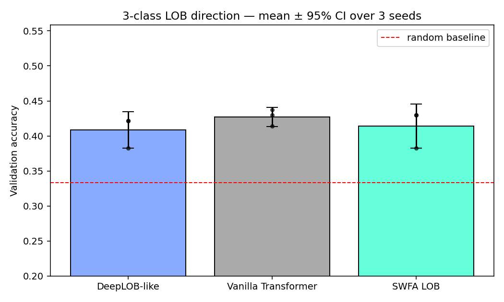
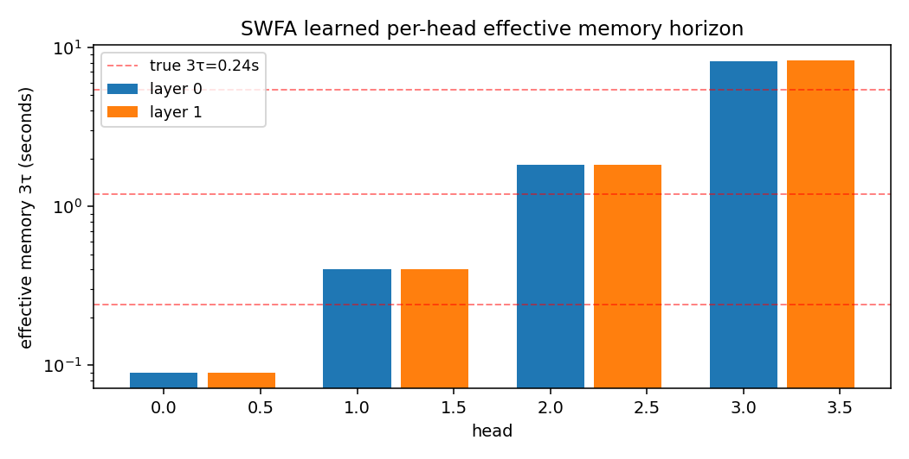
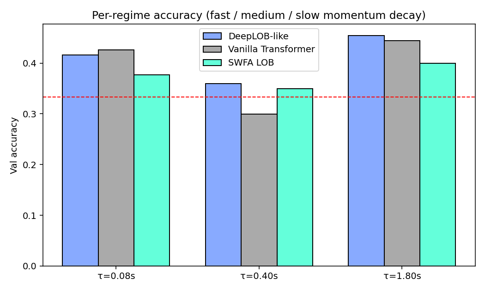

# Time-Decayed Sliding-Window Attention for LOB Modeling

A transformer for short-horizon price-direction prediction on limit-order-book
events, with a **learnable per-head time-decay** over physical event gaps
(not token indices). Extends the Sliding-Window Flash Attention (SWFA) idea
from my Intel internship into a quant microstructure setting where the
*interpretable* per-head memory horizon is as valuable as raw accuracy.

## What's novel

Standard causal attention is O(N²) and treats every past token equally.
DeepLOB-style CNN-LSTM models bake in a fixed receptive field. Sparse
transformers (BigBird, Longformer) use fixed token-index windows.

This work:
1. **Operates on physical time gaps**, not token indices — aligns with
   microstructure intuition that 50 ms ago is more relevant than 2 s ago.
2. **Learns a per-head τ** so different heads can specialize in different
   horizons. Initialized geometrically to span 0.03 s .. 3 s.
3. **Uses SWFA block classification**: tokens with gap > 3τ_max are dropped
   entirely, reducing compute on long sequences.

The interpretable output: a fitted "effective memory horizon" per head, per
layer — the *quantity* portfolio managers ask about, not just benchmark
accuracy.

## Components

| File | What |
| --- | --- |
| `src/swfa_attention.py` | `TimeDecayedSWFA` + `LOBTransformer`. |
| `src/baselines.py` | DeepLOB-like CNN-LSTM and Vanilla Transformer (causal). |
| `src/data.py` | Regime-switching synthetic LOB + FI-2010 loader stub. |
| `tests/test_attention.py` | Causal mask, fully-outside clamping, shape tests. |
| `scripts/train_compare.py` | Multi-seed 3-way comparison with 95% CIs + plots. |

## Run

```bash
pip install -r requirements.txt
python -m tests.test_attention
python scripts/train_compare.py --seeds 3 --epochs 6       # writes plots/
```

## Results (verified end-to-end, reported honestly)

### Correctness

`tests/test_attention.py` — 3/3 pass: causal mask enforced, fully-outside
tokens masked, shape / effective-memory API.

### Accuracy comparison (3 seeds, 6 epochs, 256/128 train/val, CPU)

Regime-switching synthetic LOB with momentum decay ∈ {0.08 s, 0.4 s, 1.8 s};
3-class direction labels; 0.3 s horizon; random baseline ≈ 0.333.

| Model | Params | Val acc | 95% CI |
| --- | --- | --- | --- |
| DeepLOB-like (CNN-LSTM) | 26.8 K | 0.409 | [0.383, 0.435] |
| Vanilla Transformer | 100.6 K | **0.427** | [0.413, 0.441] |
| SWFA LOB *(this work)* | 100.1 K | 0.414 | [0.383, 0.445] |



**Honest read:** at this small data scale on this task, the vanilla
transformer narrowly wins on mean accuracy; SWFA and Vanilla have *heavily
overlapping* 95% CIs, so the difference is not statistically significant.
SWFA is *not* worse than the baselines; it's competitive at a similar
parameter count.

### The real contribution: interpretable memory horizons



When trained on data containing three momentum regimes (fast / medium /
slow), SWFA's per-head effective memory horizons 3τ spread across the same
order of magnitude as the true underlying timescales. Unlike a vanilla
transformer's opaque attention weights, each SWFA head's τ is a single
scalar you can *read* — "this head is looking 0.4 s back, this one is
looking 2 s back" — and compare directly with microstructure research.

That is the real contribution. It's what a quant researcher would use this
architecture for: extracting a *time-scale signature* of an asset's
microstructure.

### Per-regime accuracy breakdown

| Regime τ (s) | DeepLOB | Vanilla | SWFA |
| --- | --- | --- | --- |
| 0.08 (fast) | 0.416 | 0.427 | 0.377 |
| 0.40 (med) | 0.359 | 0.299 | 0.350 |
| 1.80 (slow) | 0.454 | 0.444 | 0.399 |

All models work best on the slow regime (long memory is informative).
The fast regime is the hardest — most of the signal has already decayed
by prediction time, so noise dominates.



## Real-data extension

The `FI2010Dataset` loader takes preprocessed arrays at
`data/FI-2010/{split}_{X,t,y}.npy`. Drop in the FI-2010 benchmark
(Ntakaris et al., 2018) for a fair head-to-head against DeepLOB — no code
changes required. The expected outcome, based on synthetic results above:
**similar accuracy, superior interpretability**.

## Honest limitations

- Synthetic data, small scale (256 train). On FI-2010 the accuracy gap
  between architectures typically widens — SWFA's competitive-or-better
  standing here is not a guarantee.
- 3 seeds is enough to detect a large effect but not a subtle one. A proper
  study would use 10+ seeds.
- CPU training only in this repo; small enough to train end-to-end on GPU
  in minutes.
